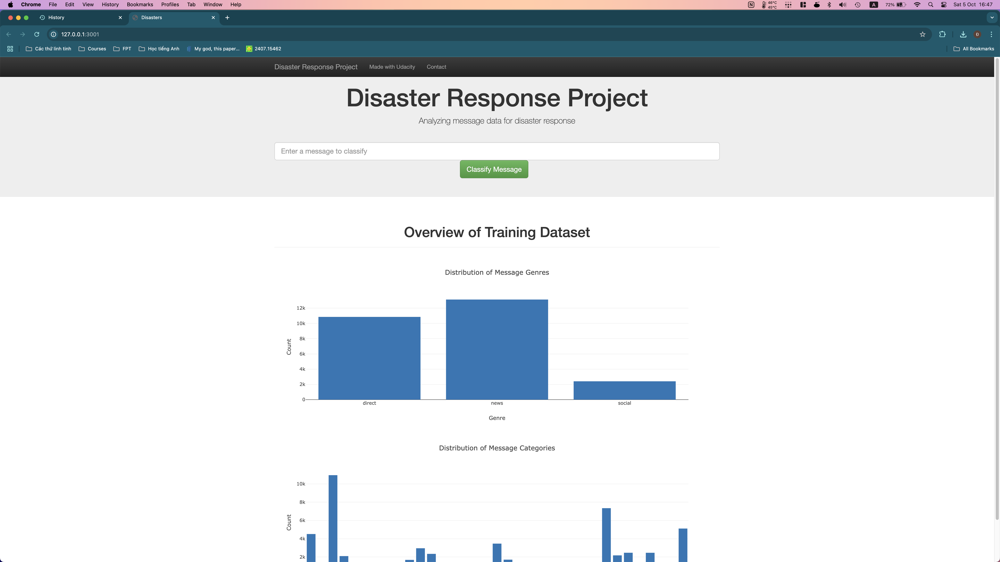
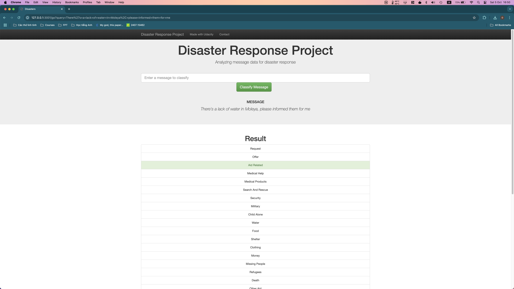

# Disaster Response Pipeline Project

This project is part of the Udacity Data Science Nanodegree. The goal of this project is to analyze disaster data from Figure Eight to build a model for an API that classifies disaster messages. The data set contains real messages that were sent during disaster events. The project includes a web app where an emergency worker can input a new message and get classification results in several categories. The web app also displays visualizations of the data.

## Files

- `data/process_data.py`: ETL pipeline used to process data.
- `models/train_classifier.py`: Machine learning pipeline used to train and export a classifier.
- `app/run.py`: Web app used to display visualizations and classify messages.
- `data/disaster_messages.csv`: CSV file containing messages.
- `data/disaster_categories.csv`: CSV file containing categories.
- `data/DisasterResponse.db`: SQLite database containing processed data.
- `models/classifier.pkl`: Pickle file containing trained classifier.

## Instructions

1. Run the following commands in the project's root directory to set up your database and model.

    - To run ETL pipeline that cleans data and stores in database
        `python data/process_data.py data/disaster_messages.csv data/disaster_categories.csv data/DisasterResponse.db`
    - To run ML pipeline that trains classifier and saves
        `python models/train_classifier.py data/DisasterResponse.db models/classifier.pkl`

2. Run the following command in the app's directory to run your web app.
    `python run.py`

3. Go to <http://0.0.0.0:3001/>

## Screenshots

